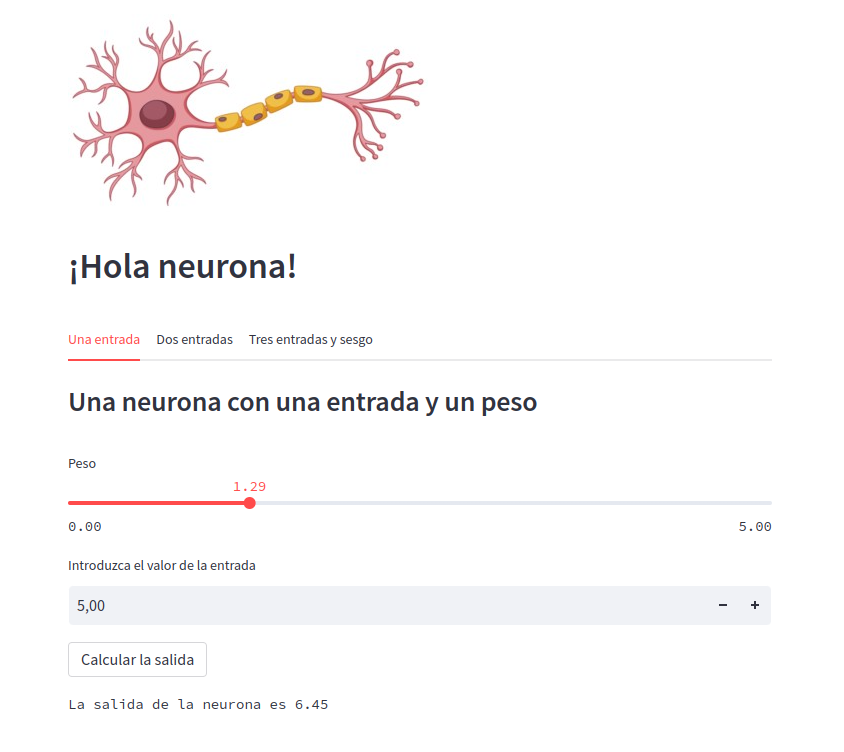
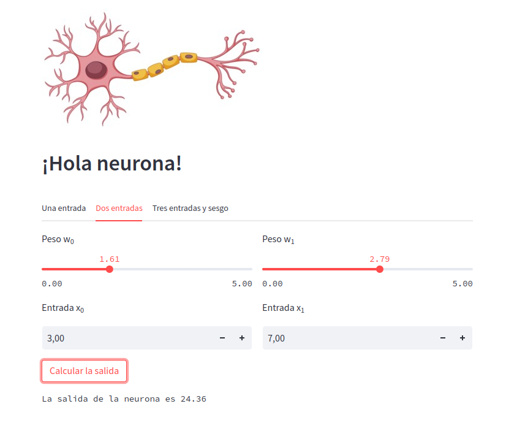
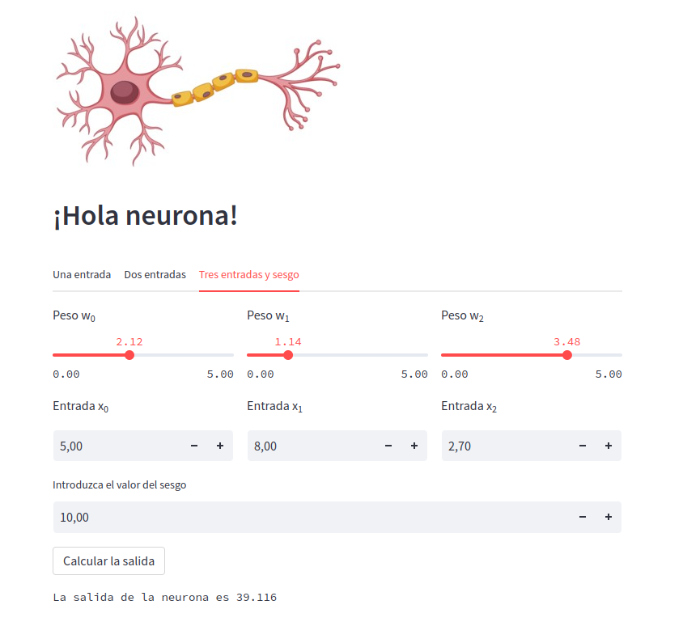

# ¡Hola neurona!

Tres ejemplos básicos de neurona desarrollados con Python y Streamlit.

Aplicación en vivo: <https://luisjosesanchez-streamlit-hola-neurona-streamlit-app-ue41b0.streamlit.app/>

